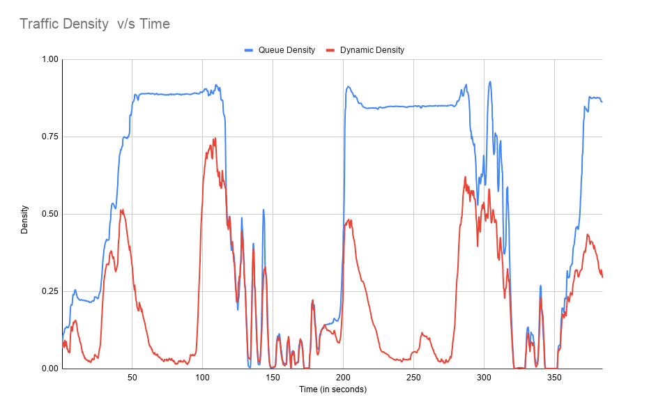

# COP290: Assignment 1 

## About:
The tar file contains one C++ code file and one make file along with two images- ```empty.jpg``` and ```traffic.jpg```.

The repo contains one C++ code file and one make file along with one image extracted from the video- ```bg.jpg``` which is used as a background.

We have also added our output as ```out.txt``` and the chart based on this data as ```Traffic_Density.png```.

### Estimated Traffic Density


## How to Run the Code:
### Part 1-
1. Put the code file and Makefile along with the images in the same folder.
2. Run 
    ```
    make
    ```
3. Run 
    ```
    ./output image
    ``` 
    where image = ```empty``` or ```traffic``` or any other suitable image. 
4. Select four images on the displayed grayscale image in ```clockwise direction``` i.e. select
    ``` 
    TOP-LEFT -> TOP-RIGHT -> BOTTOM-RIGHT -> BOTTOM-LEFT
    ``` 
    The selected point will be shown by a small ```black``` dot.
5. The projected image will be displayed. To see the cropped image ```press any key``` on keyboard.
6. To exit the program, ```press any key```. The corresponding images will be stored in the same folder.
### Part 2-
1. Put the code file and Makefile along with the background image in the same folder.
2. Run 
    ```
    make
    ```
3. Run 
    ```
    ./output video
    ``` 
    where video = ```trafficvideo``` or any other suitable video file of mp4 type. 

4. Three values will be printed on the console- 
    ```
    Time(in seconds) Queue Density Dynamic Density
    ```
5. For user's convienence, the above printed values is stored in a csv file named as- ```output.csv```.

### Brief Description of the code:
The code takes the source image as input and the user is asked to select four points on the shown image. After selecting four points, the projected image is displayed by performing homography using the user's selected set of points and a seperate set of points already present in the code. Another homography is performed between user's selected points and the four corner of the final cropped image. Corresponding windows are shown for the outputed images.
## References-
1. [Tutorial 1](https://docs.opencv.org/master/d9/dab/tutorial_homography.html)
2. [Tutorial 2](https://learnopencv.com/homography-examples-using-opencv-python-c/)

## Authors-

* [T Abishek](https://github.com/abishek2188/) -   2019CS10407
* [Gaurav Jain](https://github.com/GAURAV-28)   -   2019CS10349

